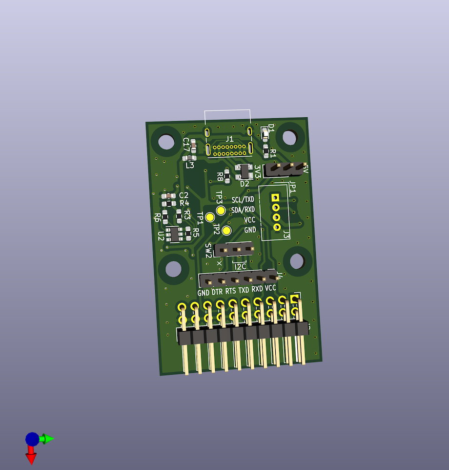
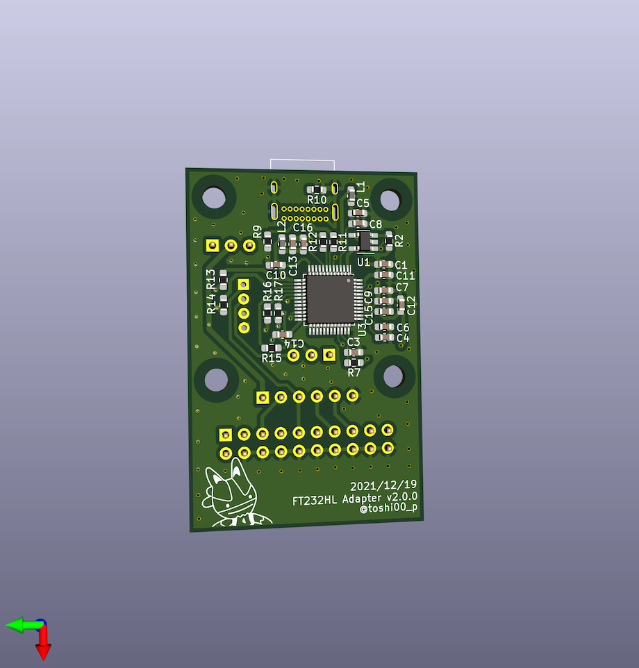

# JtagAdapter

jtag adapter using FT232H  
Created during the Security Camp 2021 X-2 track

## License

SiT2001B-MEMS-Clock-Generator symbol is based on https://github.com/asukiaaa/kicad-symbols-asukiaaa
